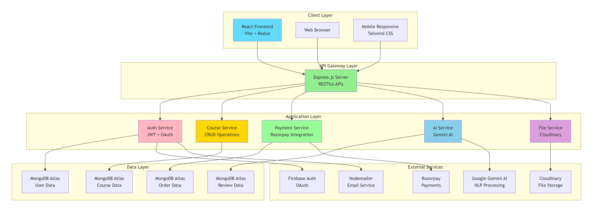

# Learning Management System (LMS) 
*A modern, full-stack Learning Management System that empowers educators to create and sell courses while providing students with an intuitive learning experience powered by AI-enhanced search.*

## ✨ Features For Students

- 🔍 AI-Powered Search - Find courses using natural language queries powered by Google Gemini AI 
- 📚 Course Enrollment - Browse and enroll in courses across multiple categories and difficulty levels
- 🎥 Video Learning - Stream course lectures with a custom video player 
- ⭐ Review System - Rate and review courses to help other students 
- 👤 Personal Dashboard - Track enrolled courses and manage your profile 
- 🔐 Secure Authentication - JWT-based auth with Google OAuth integration

## For Educators

- 📝 Course Creation - Build comprehensive courses with multiple lectures
- 💰 Monetization - Set prices and sell courses through integrated payment processing
- 📊 Course Management - Full CRUD operations for courses and lectures
- 🖼️ Media Upload - Upload thumbnails and videos with Cloudinary integration
- 📈 Student Analytics - Track enrollments and course performance

## Technical Highlights

- ⚡ Fast and responsive UI with React 19 and Vite - 🎨 Beautiful design with Tailwind CSS 
- 🔄 Real-time state management with Redux Toolkit 
- 💳 Secure payments via Razorpay 
- ☁️ Cloud storage with Cloudinary 
- 🤖 AI-enhanced search capabilities

## 🏗️ Architecture
.

### Backend Stack
- Runtime: Node.js
- Framework: Express.js
- Database: MongoDB with Mongoose ODM
- Authentication: JWT + bcryptjs
- Payment: Razorpay
- AI: Google Generative AI (Gemini)
- Storage: Cloudinary
- Email: Nodemailer
### Frontend Stack
- Framework: React 19
- Build Tool: Vite
- State Management: Redux Toolkit
- Routing: React Router
- Styling: Tailwind CSS
- HTTP Client: Axios
- Auth: Firebase

## 📋 Prerequisites
Before you begin, ensure you have the following installed:

- Node.js (v16 or higher)
- MongoDB (local or Atlas account)
- npm or yarn package manager

### 🚀 LMS Platform - Getting Started Guide
Quick Setup Instructions

### 1. Clone the Repositories:


```
git clone <your-repository-url>
cd lms-platform
```

### Install backend dependencies
```
cd backend
npm install
```

### Install frontend dependencies
```
cd ../frontend
npm install
```
### 2. Backend Configuration
Navigate to the backend directory and create a .env file with the following content:

env
```
PORT=8000
MONGODB_URL=
JWT_SECRET=
CLOUDINARY_CLOUD_NAME=
CLOUDINARY_API_KEY=
CLOUDINARY_API_SECRET=
EMAIL=
EMAIL_PASS=
RAZORPAY_KEY_ID=
RAZORPAY_SECRET=
GEMINI_API_KEY=
```
### 3. Frontend Configuration
Navigate to the frontend directory and create a .env file with:

env
```
VITE_API_URL=http://localhost:8000/api
VITE_FIREBASE_APIKEY=
VITE_RAZORPAY_KEY_ID=
```
### 4. Start the Application
Start Backend Server:

```
cd backend
npm start
```
Backend will run on: http://localhost:8000

Start Frontend Development Server:

```
cd frontend
npm run dev
```
Frontend will run on: http://localhost:5173

### 5. Access the Application
Open your browser and navigate to:

text
http://localhost:5173
